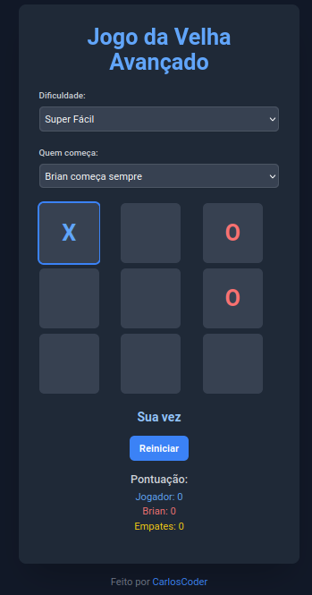

# Brian da Velha

Brian da Velha é uma versão avançada e divertida do clássico jogo da velha, onde você joga contra um oponente de inteligência artificial chamado Brian. O jogo oferece múltiplos níveis de dificuldade e recursos interessantes para uma experiência de jogo envolvente.

<div align="center">
  
</div>

## Características

- Interface de usuário moderna e responsiva
- Múltiplos níveis de dificuldade, de "Super Fácil" a "Supremo"
- Opções para escolher quem começa o jogo
- Sistema de pontuação para acompanhar vitórias, derrotas e empates
- Animações suaves para uma experiência de jogo agradável
- Design com tema escuro para conforto visual

## Tecnologias Utilizadas

- HTML5
- CSS3 e Tailwind CSS
- JavaScript (ES6+)

## Estrutura do Projeto

brian-da-velha/
│
├── css/
│   └── styles.css
├── js/
│   └── script.js
└── index.html

## Como Jogar

1. Abra o arquivo `index.html` em seu navegador web.
2. Escolha o nível de dificuldade desejado.
3. Selecione quem deve começar o jogo (você, Brian, alternado ou aleatório).
4. Clique em "Começar" para iniciar o jogo.
5. Clique em uma célula vazia para fazer sua jogada.
6. Tente vencer Brian formando uma linha, coluna ou diagonal com três de suas marcações.

## Instalação e Execução

1. Clone este repositório:

```bash
git clone https://github.com/iscarloscoder/brian-da-velha.git
```

2. Navegue até o diretório do projeto:

```bash
cd brian-da-velha
```

3. Abra o arquivo `index.html` em seu navegador web preferido.

## Desenvolvimento

Para modificar ou melhorar o jogo:

1. Edite o arquivo `index.html` para alterar a estrutura da página.
2. Modifique `css/styles.css` para ajustar os estilos e o layout.
3. Atualize `js/script.js` para alterar a lógica do jogo ou adicionar novas funcionalidades.

## Contribuições

Contribuições são bem-vindas! Sinta-se à vontade para abrir issues ou enviar pull requests com melhorias.

## Licença

Este projeto está licenciado sob a [MIT License](https://opensource.org/licenses/MIT).

## Autor

Desenvolvido por CarlosCoder

---

Divirta-se jogando Brian da Velha!
